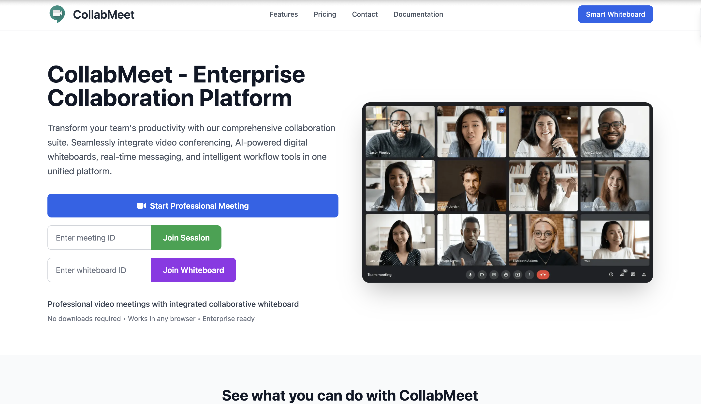
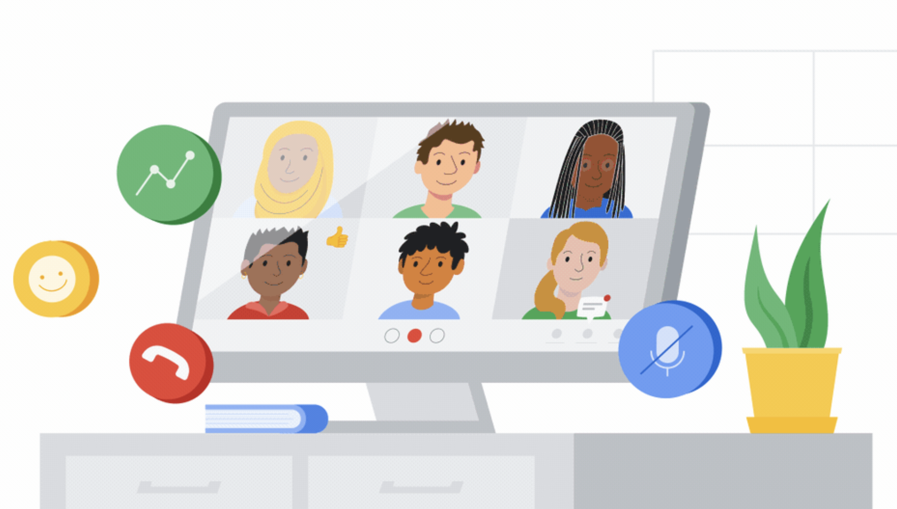
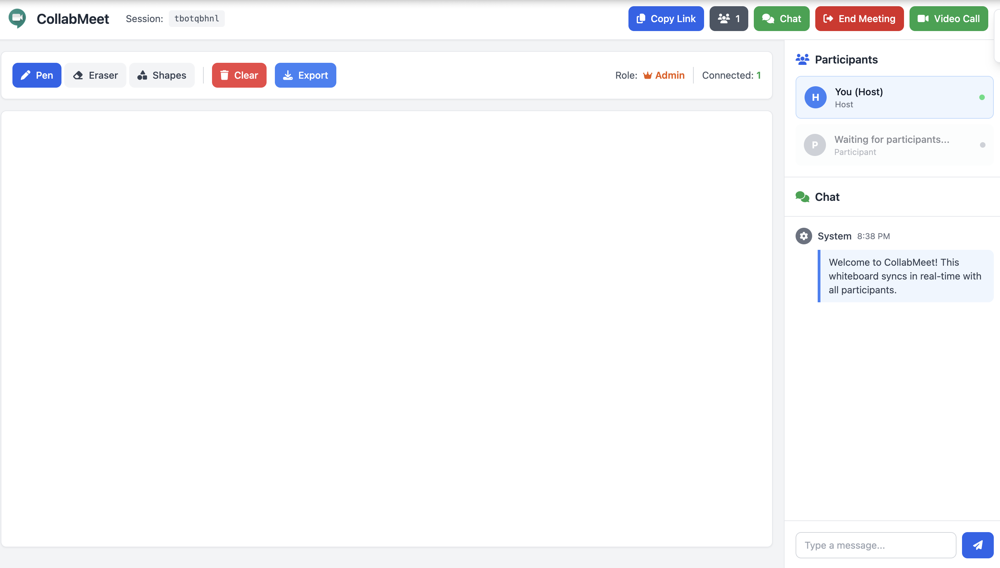
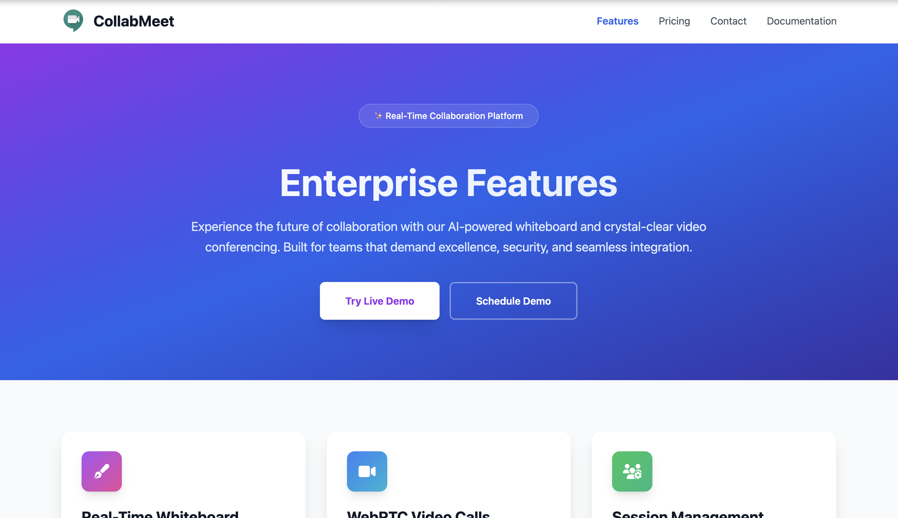
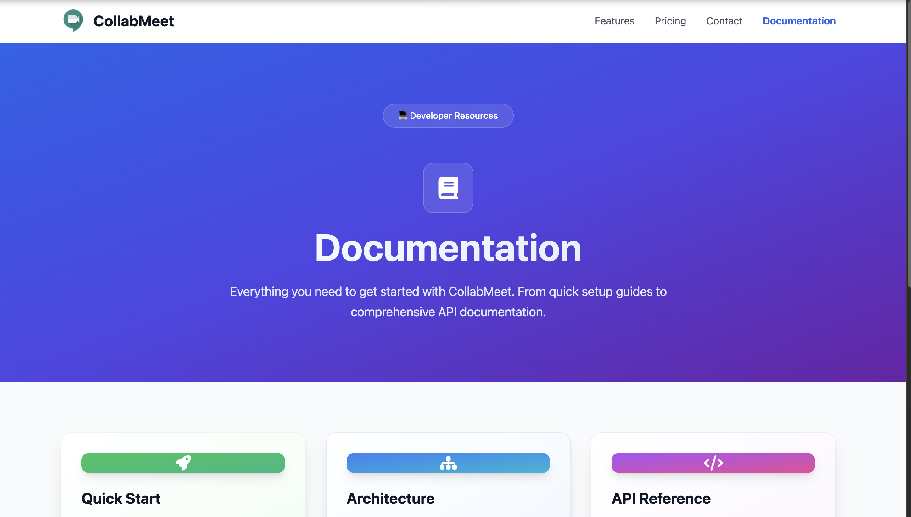
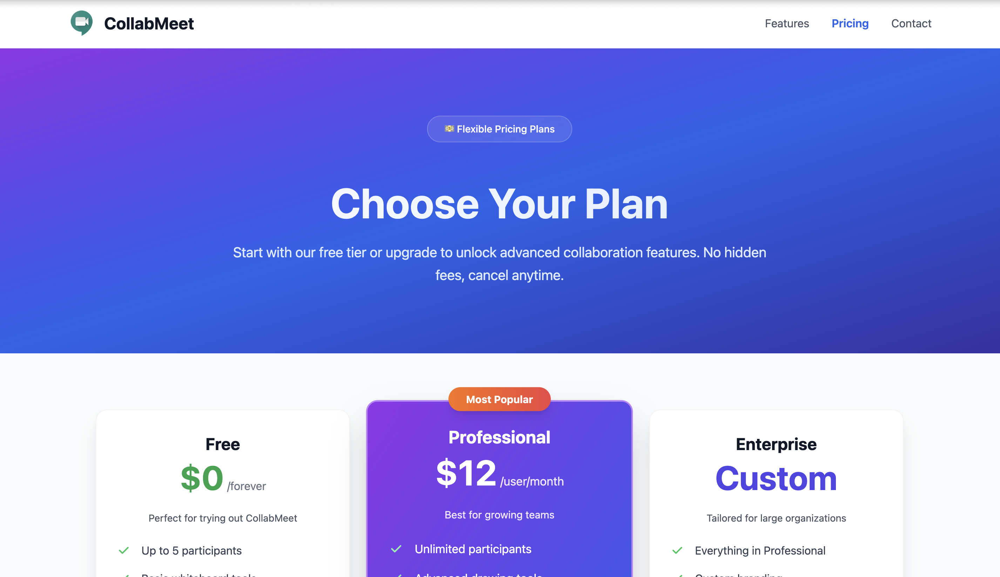
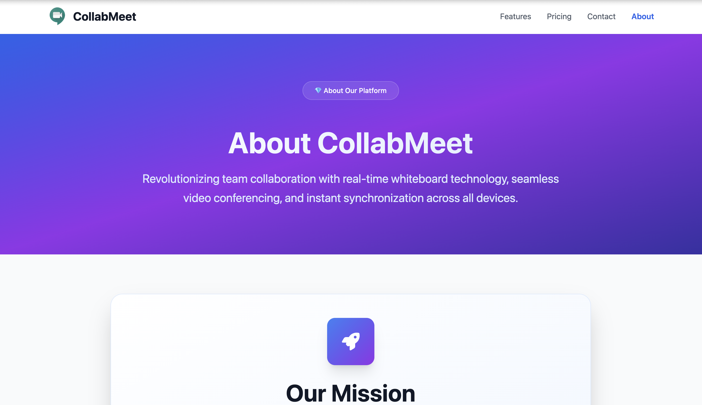
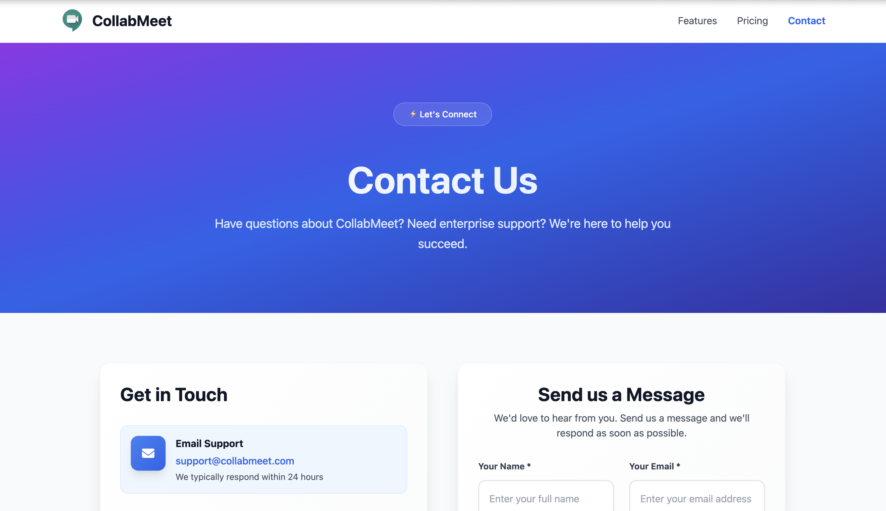
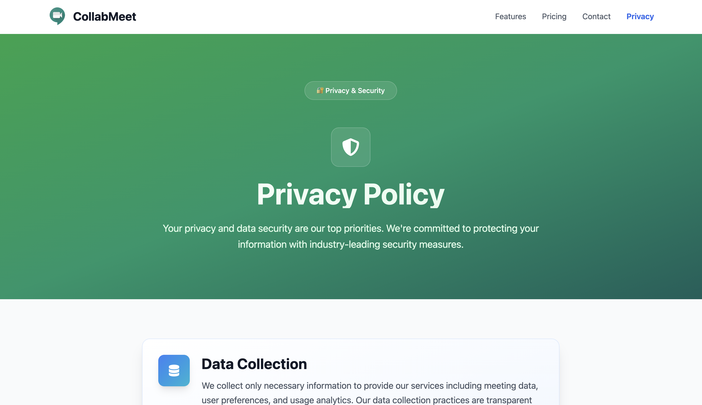
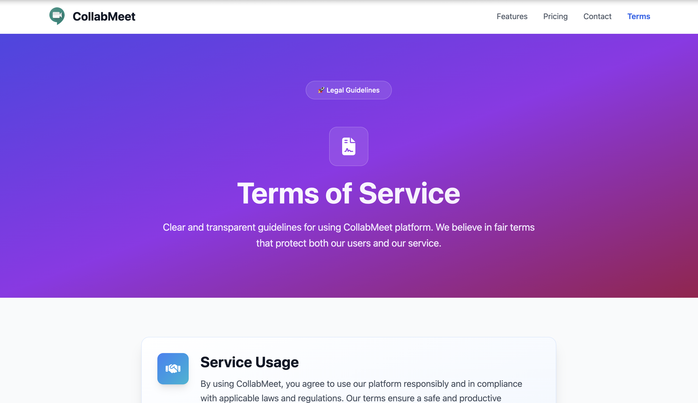

<h1 align="center">🎨 CollabMeet — Collaborate. Communicate. Create.</h1>

<p align="center">
  🚀 A comprehensive web application for real-time collaboration featuring <b>WebRTC video calls</b>, <b>live whiteboard</b>, and seamless team communication with professional meeting management.
</p>

<p align="center">
  
  
  
  
  
  
</p>
<br>

---

## 📖 Problem Statement
Remote teams struggle with effective collaboration, requiring multiple tools for video calls, whiteboard sessions, and real-time communication. Traditional solutions are fragmented, expensive, and lack seamless integration between video conferencing and collaborative drawing.

<br>

---

## 💡 Our Solution
CollabMeet is a unified collaboration platform built to:

- 🎥 Provide crystal-clear WebRTC video calls with screen sharing
- 🎨 Enable real-time collaborative whiteboard with live synchronization
- 💬 Offer integrated chat system with instant messaging
- 👥 Support professional meeting management with admission control
- 📱 Work seamlessly across all devices without downloads
<br>

---  

## 🚀 Features

✅  **WebRTC peer-to-peer video calls** with HD quality  
✅  **Real-time collaborative whiteboard** with live drawing sync  
✅  **Professional meeting management** with host controls  
✅  **Integrated chat system** with real-time messaging  
✅  **Screen sharing capabilities** for presentations  
✅  **Cross-platform compatibility** - works on any browser  
✅  **Session management** with unique meeting IDs  
✅  **Responsive design** optimized for all devices

<br>

---  

## 🛠️ Tech Stack

<div align="center">

<table>
<thead>
<tr>
<th>🖥️ Technology</th>
<th>⚙️ Description</th>
</tr>
</thead>
<tbody>
<tr>
<td></td>
<td>Modern semantic markup with Canvas API</td>
</tr>
<tr>
<td></td>
<td>ES6+ with real-time WebRTC implementation</td>
</tr>
<tr>
<td></td>
<td>High-performance backend server</td>
</tr>
<tr>
<td></td>
<td>Peer-to-peer video communication</td>
</tr>
<tr>
<td></td>
<td>Real-time bidirectional communication</td>
</tr>
<tr>
<td></td>
<td>Utility-first CSS framework</td>
</tr>
<tr>
<td></td>
<td>Fast web application framework</td>
</tr>
</tbody>
</table>

</div>

<br>

---

## 📁 Project Directory Structure

```
CollabMeet - Collaborate. Communicate. Create./
├── 📂 frontend/                    # 🎨 Frontend application
│   ├── 📂 assets/
│   │   ├── 📂 css/                 # 🎨 Stylesheets
│   │   │   └── 📄 mobile-responsive.css
│   │   ├── 📂 images/              # 🖼️ Static images
│   │   │   ├── 📄 accessibility-features.webp
│   │   │   ├── 📄 cross-platform.webp
│   │   │   ├── 📄 digital-whiteboard.webp
│   │   │   ├── 📄 hd-video-quality.webp
│   │   │   ├── 📄 hero-collaboration.webp
│   │   │   └── 📄 security-features.webp
│   │   └── 📂 js/                  # ⚡ JavaScript modules
│   │       ├── 📄 homepage.js      # 🏠 Landing page logic
│   │       ├── 📄 video-call-manager.js # 🎥 WebRTC management
│   │       ├── 📄 collaborative-whiteboard.js # 🎨 Whiteboard engine
│   │       └── 📄 participant-modal.js # 👥 User management
│   ├── 📂 pages/                   # 📄 HTML pages
│   │   ├── 📄 about.html           # ℹ️ About page
│   │   ├── 📄 accessibility.html   # ♿ Accessibility features
│   │   ├── 📄 architecture.html    # 🏗️ System architecture
│   │   ├── 📄 collaborative-board.html # 🎨 Whiteboard interface
│   │   ├── 📄 contact.html         # 📞 Contact information
│   │   ├── 📄 developer-api.html   # 🔧 Developer API docs
│   │   ├── 📄 documentation.html   # 📚 Documentation
│   │   ├── 📄 meeting-room.html    # 🎥 Video call interface
│   │   ├── 📄 privacy.html         # 🔒 Privacy policy
│   │   ├── 📄 product-features.html # ✨ Feature showcase
│   │   ├── 📄 security.html        # 🛡️ Security features
│   │   ├── 📄 subscription-plans.html # 💰 Pricing plans
│   │   └── 📄 terms.html           # 📋 Terms of service
│   ├── 📄 index.html               # 🏠 Landing page
│   └── 📄 loading.html             # ⏳ Loading page
├── 📂 backend/                     # 🔧 Node.js backend
│   ├── 📄 websocket-server.js      # 🚀 WebSocket server
│   ├── 📄 package.json             # 📦 Dependencies
│   └── 📄 package-lock.json        # 🔒 Dependency lock
├── 📂 docs/                        # 📸 Screenshots & Documentation
│   ├── 📄 About_Page.png           # About page screenshot
│   ├── 📄 Contact_Page.png         # Contact page screenshot
│   ├── 📄 Documentation_Page.png   # Documentation screenshot
│   ├── 📄 Features_Page.png        # Features page screenshot
│   ├── 📄 Home_Page.png            # Home page screenshot
│   ├── 📄 Loading_Page.png         # Loading page screenshot
│   ├── 📄 Pricing_Page.png         # Pricing page screenshot
│   ├── 📄 Privacy_Page.png         # Privacy page screenshot
│   ├── 📄 Terms_Page.png           # Terms page screenshot
│   └── 📄 WhiteBoard_Page.png      # Whiteboard screenshot
├── 📄 .gitignore                   # 🚫 Git ignore rules
├── 📄 launch-collabmeet.sh         # 🚀 Quick start script
├── 📄 package.json                 # 📦 Project configuration
└── 📄 README.md                    # 📖 Documentation

```

<br>

---

## 📸 Screenshots

<div align="center">

### 🏠 Home Page


### ⏳ Loading Page


### 🎨 Collaborative Whiteboard


### ✨ Features Overview


### 📚 Documentation


### 💰 Pricing Plans


### ℹ️ About Us


### 📞 Contact Us


### 🔒 Privacy Policy


### 📋 Terms of Service


</div>

<br>

---

## 📦 How to Run

### 📌 Prerequisites
- ✅ **Node.js 14+** installed
- ✅ **Modern web browser** (Chrome, Firefox, Safari, Edge)
- ✅ **Camera and microphone** for video calls
- ✅ **HTTPS** for production deployment

<br>

---  

### 🚀 Quick Start

1. Clone and start the platform:

   ```bash
   git clone https://github.com/abhishekgiri04/CollabMeet.git
   cd "CollabMeet - Collaborate. Communicate. Create."
   chmod +x launch-collabmeet.sh
   ./launch-collabmeet.sh
   ```

2. Access the platform:

   ```
   http://localhost:8080
   ```

### 🔧 Manual Setup

```bash
# Install backend dependencies
cd backend
npm install

# Start the server
npm start

# Access the application
open http://localhost:8080
```

### 🛑 Stop Services

```bash
# Stop the server
Ctrl+C

# Or kill the process
pkill -f websocket-server.js
```
<br>

---

## 📖 Core Components

* **homepage.js** — Landing page with session management
* **video-call-manager.js** — WebRTC implementation with peer connections
* **collaborative-whiteboard.js** — Real-time drawing synchronization
* **websocket-server.js** — Backend server with session handling
* **meeting-room.html** — Professional video call interface
* **collaborative-board.html** — Interactive whiteboard with tools

<br>

---

## 🌐 API Endpoints

```bash
# WebSocket Server (Port 8080)
WS   /                  # WebSocket connection for real-time communication
GET  /                  # Serve static frontend files
POST /api/sessions      # Create new meeting session
GET  /api/sessions/:id  # Get session information
POST /api/contact       # Contact form submission
GET  /api/stats         # Platform statistics
```
<br>

---

## 🧪 Testing

```bash
# Test server connection
curl http://localhost:8080

# Test WebSocket connection
wscat -c ws://localhost:8080

# Test video call functionality
# 1. Open http://localhost:8080
# 2. Click "Start Professional Meeting"
# 3. Allow camera/microphone permissions
# 4. Share meeting ID with participants
```

## ⚠️ Common Issues

**Camera/Microphone not working:**
- Check browser permissions
- Ensure HTTPS in production
- Try different browser

**WebSocket connection failed:**
```bash
# Check if port 8080 is available
lsof -i :8080

# Restart the server
./launch-collabmeet.sh
```

**Video call not connecting:**
- Ensure both users are in same session
- Check WebRTC compatibility
- Verify STUN server access
<br>

---

## 🎨 Features Overview

### 🎥 Video Calls
- **WebRTC Technology** — Direct peer-to-peer connections
- **HD Video Quality** — Crystal clear video communication
- **Screen Sharing** — Share presentations and documents
- **Mute/Unmute Controls** — Professional audio management

### 🎨 Collaborative Whiteboard
- **Real-time Drawing** — Instant synchronization across users
- **Drawing Tools** — Pen, eraser, shapes, and colors
- **Export Functionality** — Download whiteboard as PNG
- **Multi-user Support** — Unlimited participants

### 👥 Meeting Management
- **Host Controls** — Admit/reject participants
- **Session IDs** — Unique meeting identifiers
- **Participant List** — Real-time user management
- **Chat Integration** — Built-in messaging system

<br>

---

## 📊 Performance Metrics

- **99.9% Uptime** — Reliable service availability
- **<50ms Latency** — Real-time collaboration
- **Unlimited Users** — Scalable architecture
- **Cross-Platform** — Works on all devices
- **Zero Downloads** — Browser-based solution

<br>

---

## 🌱 Future Scope
- 📱 **Mobile App** — Native iOS and Android applications
- 🔐 **Enterprise Security** — Advanced authentication and encryption
- 📊 **Analytics Dashboard** — Meeting insights and statistics
- 🎬 **Recording Feature** — Save meetings and whiteboard sessions
- 🌍 **Global CDN** — Worldwide content delivery network

<br>

---  

## 📞 Help & Contact  

> 💬 *Got questions or need assistance with CollabMeet?*  
> We're here to help with technical support and collaboration!

<div align="center">

**👤 Abhishek Giri**  
<a href="https://www.linkedin.com/in/abhishek-giri04/">
  
</a>  
<a href="https://github.com/abhishekgiri04">
  
</a>  
<a href="https://t.me/AbhishekGiri7">
  
</a>

<br/>

---

**🎨 Built with ❤️ for Seamless Collaboration**  
*Transforming Remote Work Through Real-Time Innovation*

</div>

---

<div align="center">

**© 2025 CollabMeet. All Rights Reserved.**

</div>